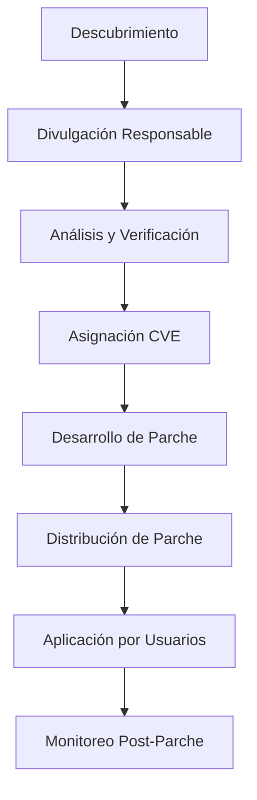

# Guía Completa de Ciberseguridad orientada a Vulnerabilidades

Este documento sirve como una guía centralizada de la mayoría de temas relacionados con la seguridad en el desarrollo de software. Más específicamente, orientado a Vulnerabilidades.

## Tabla de Contenidos

1. [Fundamentos de Ciberseguridad](#1-fundamentos-de-ciberseguridad)
2. [La Tríada CIA - Principios Fundamentales](#2-la-tríada-cia---principios-fundamentales)
3. [Principios de Diseño Seguros](#3-principios-de-diseño-seguros)
4. [Vulnerabilidades y Debilidades](#4-vulnerabilidades-y-debilidades)
5. [Sistemas de Identificación y Evaluación](#5-sistemas-de-identificación-y-evaluación)
6. [Gestión de Dependencias](#6-gestión-de-dependencias)
7. [Buenas Prácticas de Desarrollo Seguro](#7-buenas-prácticas-de-desarrollo-seguro)
8. [Gestión de Secretos e Información Sensible](#8-gestión-de-secretos-e-información-sensible)
9. [Compliance y Estándares](#9-compliance-y-estándares)
10. [Fuentes y Recursos Útiles](#10-fuentes-y-recursos-útiles)

---

## 1. Fundamentos de Ciberseguridad

### ¿Qué es la Ciberseguridad?

La ciberseguridad es la práctica de proteger sistemas, redes y programas de ataques digitales. En el contexto del desarrollo de software, se refiere a la implementación de medidas preventivas, detectivas y correctivas para proteger aplicaciones y datos contra amenazas internas y externas.

### Conceptos Clave

- **Superficie de Ataque**: Todos los puntos donde un atacante podría intentar ingresar o extraer datos del sistema
- **Modelo de Amenazas**: Representación estructurada de todas las amenazas potenciales a un sistema

---

## 2. La Tríada CIA - Principios Fundamentales

Los tres pilares fundamentales de la seguridad de la información:

### 2.1 Confidencialidad (Confidentiality)

**Objetivo**: Garantizar que la información solo sea accesible por personas autorizadas.

**Implementación en desarrollo**:

- Cifrado de datos en tránsito y en reposo
- Control de acceso basado en roles (RBAC)
- Autenticación multifactor (MFA)
- Tokens de acceso con expiración

### 2.2 Integridad (Integrity)

**Objetivo**: Asegurar que los datos no sean modificados de manera no autorizada.

**Implementación en desarrollo**:

- Checksums y hashing
- Firmas digitales
- Control de versiones
- Validación de entrada de datos

### 2.3 Disponibilidad (Availability)

**Objetivo**: Garantizar que los sistemas estén disponibles cuando se necesiten.

**Implementación en desarrollo**:

- Redundancia y failover
- Rate limiting
- Monitoreo y alertas
- Planes de recuperación ante desastres

---

## 3. Principios de Diseño Seguros

Los principios de diseño seguros son fundamentos conceptuales que guían el desarrollo de sistemas resilientes ante amenazas. Estos principios, desarrollados a lo largo de décadas de investigación en seguridad informática, proporcionan un marco para la toma de decisiones arquitectónicas y de implementación.

### 3.1 Least Privilege (Principio de Menor Privilegio)

**Definición**: Un sujeto debería tener solo los privilegios mínimos necesarios para completar su tarea específica.

**Implementación en desarrollo**:

- **Cuentas de servicio**: Cada servicio ejecuta con permisos específicos, no como administrador
- **Permisos de API**: Endpoints requieren autorización granular
- **Acceso a base de datos**: Usuarios con permisos limitados por esquema/tabla
- **Permisos de archivos**: Aplicaciones con acceso restringido al sistema de archivos

### 3.2 Defense in Depth (Defensa en Profundidad)

**Definición**: Estrategia de seguridad que integra personas, tecnología y capacidades operativas para establecer múltiples barreras en diferentes capas de la organización.

**Capas de implementación**:

1. **Capa de Red**: Firewalls, segmentación, VPN
2. **Capa de Infraestructura**: Sistemas de detección de intrusos, antivirus
3. **Capa de Aplicación**: Validación de entrada, autenticación, autorización
4. **Capa de Datos**: Cifrado, control de acceso a BD, auditoría
5. **Capa de Runtime**: Monitoreo de comportamiento, detección de anomalías

### 3.3 Fail-Safe Defaults (Valores por Defecto Seguros)

**Definición**: El sistema debe negar acceso por defecto y otorgarlo solo cuando se establezca explícitamente el permiso.

### 3.4 Secure by Design (Seguro por Diseño)

**Definición**: La seguridad debe ser considerada e integrada desde las fases iniciales del diseño, no añadida posteriormente como un parche.

**Metodología de implementación**:

1. **Modelado de Amenazas**: Identificar amenazas durante el diseño
2. **Arquitectura Segura**: Componentes con responsabilidades de seguridad claras
3. **Principios de Codificación Segura**: Desde el primer commit

### 3.5 Complete Mediation (Mediación Completa)

**Definición**: Todos los accesos a objetos deben ser verificados para asegurar que están permitidos.

### 3.6 Separation of Duties (Separación de Funciones)

**Definición**: Las tareas críticas deben dividirse entre múltiples personas para prevenir fraude o errores.

### 3.7 Economy of Mechanism (Economía del Mecanismo)

**Definición**: Mantener el diseño tan simple y pequeño como sea posible para facilitar la verificación.

**Principios de implementación**:

- **Funciones específicas**: Una función, una responsabilidad
- **Interfaces simples**: APIs claras y concisas
- **Dependencias mínimas**: Reducir superficie de ataque

---

## 4. Vulnerabilidades y Debilidades

### 4.1 ¿Qué son las Vulnerabilidades?

Una vulnerabilidad es una debilidad en un sistema que puede ser explotada por un atacante para realizar acciones no autorizadas dentro del sistema. Las vulnerabilidades pueden existir en:

- Código de aplicación
- Configuraciones de sistema
- Procesos de negocio
- Controles internos

### 4.2 Tipos Comunes de Vulnerabilidades

#### Vulnerabilidades de Aplicación Web (OWASP Top 10)

Resumen de alto nivel. Para el detalle actualizado y medidas de prevención, ver la sección [9.1 OWASP Top 10](#91-owasp-open-web-application-security-project).

#### Vulnerabilidades de Infraestructura

- Configuraciones por defecto inseguras
- Servicios innecesarios expuestos
- Falta de actualizaciones de seguridad
- Credenciales débiles

### 4.3 Ciclo de Vida de una Vulnerabilidad



---

## 5. Sistemas de Identificación y Evaluación

### 5.1 CVE (Common Vulnerabilities and Exposures)

**Definición**: CVE (Common Vulnerabilities and Exposures) es un glosario que clasifica vulnerabilidades de manera estandarizada para facilitar el intercambio de información sobre seguridad.

**Organización responsable**: El programa CVE es mantenido por el MITRE Corporation, financiado por la Cybersecurity and Infrastructure Security Agency (CISA) del Departamento de Seguridad Nacional de EE.UU.

**Fuentes oficiales**:

- **Sitio principal**: [cve.mitre.org](https://cve.mitre.org/)
- **Base de datos NVD**: [nvd.nist.gov](https://nvd.nist.gov/) (National Vulnerability Database)
- **Búsqueda CVE**: [cve.mitre.org/cve/search_cve_list.html](https://cve.mitre.org/cve/search_cve_list.html)

**Estructura de un CVE ID**:

```text
CVE-YYYY-NNNNN
```

- **CVE**: Prefijo constante
- **YYYY**: Año de asignación
- **NNNNN**: Número secuencial (mínimo 4 dígitos)

**Ejemplo**: CVE-2025-20188

**Propósito**:

- Identificación única de vulnerabilidades
- Facilitar la comunicación entre organizaciones
- Referencia común para herramientas de seguridad

### 5.2 CWE (Common Weakness Enumeration)

**Definición**: CWE (Common Weakness Enumeration) es una lista comunitaria de tipos comunes de debilidades de software que proporciona una visión profunda de las causas subyacentes de las vulnerabilidades de seguridad.

**Organización responsable**: Mantenido por MITRE Corporation con apoyo de la comunidad de ciberseguridad.

**Fuentes oficiales**:

- **Sitio principal**: [cwe.mitre.org](https://cwe.mitre.org/)
- **Lista completa**: [cwe.mitre.org/data/index.html](https://cwe.mitre.org/data/index.html)
- **Top 25 CWE**: [cwe.mitre.org/top25](https://cwe.mitre.org/top25/)

**Diferencia con CVE**: Mientras CVE identifica vulnerabilidades específicas, CWE categoriza los tipos de debilidades que pueden llevar a vulnerabilidades.

**Ejemplos de CWE**:

- **CWE-79**: Cross-site Scripting (XSS)
- **CWE-89**: SQL Injection
- **CWE-200**: Exposure of Sensitive Information
- **CWE-787**: Out-of-bounds Write

### 5.3 CVSS (Common Vulnerability Scoring System)

**Definición**: CVSS (Common Vulnerability Scoring System) es un marco ampliamente utilizado para evaluar la severidad de las vulnerabilidades de seguridad de la información.

**Organización responsable**: Desarrollado y mantenido por FIRST (Forum of Incident Response and Security Teams).

**Fuentes oficiales**:

- **Sitio principal**: [first.org/cvss](https://www.first.org/cvss/)
- **Calculadora CVSS v3.1**: [nvd.nist.gov/vuln-metrics/cvss/v3-calculator](https://nvd.nist.gov/vuln-metrics/cvss/v3-calculator)
- **Calculadora CVSS v4.0**: [first.org/cvss/calculator/4.0](https://www.first.org/cvss/calculator/4.0)
- **Especificación v3.1**: [first.org/cvss/v3.1/specification-document](https://www.first.org/cvss/v3.1/specification-document)
- **Especificación v4.0**: [first.org/cvss/v4.0/specification-document](https://www.first.org/cvss/v4.0/specification-document)

#### CVSS v3.1: métricas y vectores

**Estructura del Score CVSS v3.1**:

- **Rango**: Las puntuaciones CVSS van de 0 a 10, siendo 10 la más severa
- **Versión actual**: CVSS v3.1 (2019)

**Grupos de métricas CVSS v3.1**:

##### Base Score Group

**Métricas de Explotabilidad**:

- **Attack Vector (AV)**: Network (N), Adjacent (A), Local (L), Physical (P)
- **Attack Complexity (AC)**: Low (L), High (H)
- **Privileges Required (PR)**: None (N), Low (L), High (H)
- **User Interaction (UI)**: None (N), Required (R)

**Scope**:

- **Scope (S)**: Unchanged (U), Changed (C)

**Métricas de Impacto**:

- **Confidentiality (C)**: High (H), Low (L), None (N)
- **Integrity (I)**: High (H), Low (L), None (N)
- **Availability (A)**: High (H), Low (L), None (N)

##### Temporal Score Group

- **Exploit Code Maturity (E)**: Not Defined (X), High (H), Functional (F), Proof-of-Concept (P), Unproven (U)
- **Remediation Level (RL)**: Not Defined (X), Official Fix (O), Temporary Fix (T), Workaround (W), Unavailable (U)
- **Report Confidence (RC)**: Not Defined (X), Confirmed (C), Reasonable (R), Unknown (U)

##### Environmental Score Group

**Security Requirements**:

- **Confidentiality Requirement (CR)**: Not Defined (X), High (H), Medium (M), Low (L)
- **Integrity Requirement (IR)**: Not Defined (X), High (H), Medium (M), Low (L)
- **Availability Requirement (AR)**: Not Defined (X), High (H), Medium (M), Low (L)

**Modified Base Metrics** (tienen los mismos valores que las métricas base más "Not Defined"):

- **Modified Attack Vector (MAV)**
- **Modified Attack Complexity (MAC)**
- **Modified Privileges Required (MPR)**
- **Modified User Interaction (MUI)**
- **Modified Scope (MS)**
- **Modified Confidentiality (MC)**
- **Modified Integrity (MI)**
- **Modified Availability (MA)**

**Vector string (ejemplo CVSS v3.1):** `CVSS:3.1/AV:N/AC:L/PR:H/UI:N/S:U/C:L/I:L/A:N`

#### CVSS v4.0: métricas y vectores

CVSS v4.0 agrupa métricas en: **Base, Threat, Environmental, Supplemental**. Entre las métricas Base (que describen propiedades intrínsecas) están:

- **AV** — Attack Vector (Network, Adjacent, Local, Physical)
- **AC** — Attack Complexity (Low, High)
- **AT** — Attack Requirements (None, Specific, etc. — métrica nueva v4)
- **PR** — Privileges Required (None, Low, High)
- **UI** — User Interaction (None, Required)
- **VC/VI/VA** — impacto en Confidentiality / Integrity / Availability (None/Low/Moderate/High)
- **SC/SI/SA** — Safety metrics (nuevo en v4, evalúan impacto en seguridad física/safety)

**Vector string (ejemplo):** `CVSS:4.0/AV:N/AC:H/AT:N/PR:L/UI:N/VC:N/VI:N/VA:L/SC:N/SI:N/SA:N/E:U`

**Temporal/Threat / Environmental** permiten ajustar la puntuación según exploits disponibles y el contexto de tu entorno.

> Nota: CVSS cuantifica características técnicas; **prioritar parches requiere CVSS + probabilidad (EPSS) + exposición y contexto de negocio**.

**Clasificación de Severidad CVSS**:

- **0.0**: None
- **0.1-3.9**: Low
- **4.0-6.9**: Medium
- **7.0-8.9**: High
- **9.0-10.0**: Critical

#### EPSS — probabilidad de explotación

EPSS (Exploit Prediction Scoring System) estima la **probabilidad** de que una vulnerabilidad sea explotada en el mundo real en un intervalo temporal (útil para priorizar). EPSS es complementario: CVSS dice *qué tan severa técnicamente* y EPSS dice *qué tan probable es que se explote*.

### 5.4 Advisory y GHSA

#### Security Advisory

Un advisory de seguridad es un documento que describe una vulnerabilidad específica, incluyendo:

- Descripción técnica del problema
- Sistemas afectados
- Impacto potencial
- Medidas de mitigación
- Timeline de divulgación

#### GHSA (GitHub Security Advisory)

Sistema de GitHub para reportar y trackear vulnerabilidades en proyectos open source:

**Características**:

- Integración nativa con GitHub
- Proceso de divulgación responsable
- Generación automática de CVE IDs
- Notificaciones a usuarios afectados

**Formato GHSA ID**:

```text
GHSA-xxxx-xxxx-xxxx
```

**Proceso**:

1. Reporte privado de vulnerabilidad
2. Colaboración con maintainers
3. Desarrollo de parche
4. Divulgación pública coordinada
5. Notificación automática a dependientes

---

## 6. Gestión de Dependencias

### 6.1 ¿Qué es el Dependency Pinning?

El dependency pinning es la práctica de especificar versiones exactas de dependencias en lugar de rangos de versiones, para garantizar builds reproducibles y evitar la introducción accidental de vulnerabilidades.

### 6.2 Semantic Versioning (SemVer)

**Formato**: `MAJOR.MINOR.PATCH` (ej: 2.1.3)

- **MAJOR**: Cambios incompatibles con versiones anteriores
- **MINOR**: Nueva funcionalidad retro-compatible con versiones anteriores
- **PATCH**: Correcciones de bugs retro-compatibles con versiones anteriores

### 6.3 Símbolos en package.json

#### Caret (^) - Compatible Release

**Comportamiento**: caret (^) para actualizaciones MINOR y PATCH

```json
{
  "dependencies": {
    "express": "^4.18.2"
  }
}
```

**Permite**:

- `^4.18.2` → Acepta `4.18.2` a `4.x.x` (pero no `5.0.0`)
- Incluye actualizaciones MINOR y PATCH
- Bloquea actualizaciones MAJOR

**Casos de uso**:

- Desarrollo activo donde quieres nuevas funcionalidades
- Confianza en que la dependencia sigue SemVer correctamente

#### Tilde (~) - Reasonably Close

**Comportamiento**: tilde (~) solo para actualizaciones PATCH

```json
{
  "dependencies": {
    "lodash": "~4.17.21"
  }
}
```

**Permite**:

- `~4.17.21` → Acepta `4.17.21` a `4.17.x` (pero no `4.18.0`)
- Solo actualizaciones PATCH
- Bloquea actualizaciones MINOR y MAJOR

**Casos de uso**:

- Producción donde la estabilidad es crítica
- Cuando solo quieres correcciones de bugs

#### Sin Símbolo - Exact Version

```json
{
  "dependencies": {
    "react": "18.2.0"
  }
}
```

**Permite**: Solo la versión exacta especificada

#### Otros Símbolos

##### Greater Than (>)

```json
{
  "dependencies": {
    "moment": ">2.24.0"
  }
}
```

##### Greater Than or Equal (>=)

```json
{
  "dependencies": {
    "axios": ">=0.21.0"
  }
}
```

##### Wildcards (x)

```json
{
  "dependencies": {
    "jquery": "3.6.x"
  }
}
```

##### Ranges

```json
{
  "dependencies": {
    "vue": ">=3.0.0 <4.0.0"
  }
}
```

### 6.4 Estrategias de Dependency Management

#### 6.4.1 Lock Files

**package-lock.json** (npm) / **yarn.lock** (Yarn):

- Garantizan instalaciones determinísticas
- Congelan todo el árbol de dependencias
- Críticos para reproducibilidad

#### 6.4.2 Dependency Pinning Strategies

##### Strict Pinning

```json
{
  "dependencies": {
    "express": "4.18.2",
    "lodash": "4.17.21"
  }
}
```

**Pros**: Máxima estabilidad, builds reproducibles
**Contras**: No recibe parches de seguridad automáticamente

##### Conservative Pinning

```json
{
  "dependencies": {
    "express": "~4.18.2",
    "lodash": "~4.17.21"
  }
}
```

**Pros**: Recibe parches de seguridad, mantiene estabilidad
**Contras**: Puede introducir bugs en patches

##### Progressive Pinning

```json
{
  "dependencies": {
    "express": "^4.18.2",
    "lodash": "^4.17.21"
  }
}
```

**Pros**: Nuevas funcionalidades, parches automáticos
**Contras**: Mayor riesgo de breaking changes

### 6.5 Auditoría de Dependencias

#### npm audit

```bash
# Verificar vulnerabilidades
npm audit

# Ver detalles específicos
npm audit --audit-level=moderate

# Intentar reparación automática
npm audit fix

# Reparación forzada (puede hacer breaking changes)
npm audit fix --force
```

#### Yarn audit

```bash
# Verificar vulnerabilidades
yarn audit

# Generar reporte detallado
yarn audit --verbose
```

### 6.6 Pinning vs Ranges vs Overrides / Resolutions

- **Pinning:** mayor reproducibilidad, mayor overhead de mantenimiento.
- **Ranges (caret/tilde):** permiten actualizaciones automáticas que respetan SemVer.
- **Overrides / resolutions:** fuerzan versiones específicas para sub-dependencias. Úsalos **solo como parche temporal** cuando:
  - existe un CVE en una sub-dependencia sin fix upstream;
  - no puedes esperar a que el maintainer publique fix;
  - documentas y programas eliminar el override cuando haya solución upstream.

**Recomendación:** nunca usar overrides como política permanente; siempre abrir issues/PRs upstream y, si es crítico, considerar backport o fork con un plan de mantenimiento.

---

## 7. Buenas Prácticas de Desarrollo Seguro

### 7.1 Secure Coding Practices

#### 7.1.1 Validación de Entrada

```javascript
// ❌ Malo: Sin validación
app.post('/user', (req, res) => {
    const user = new User(req.body);
    user.save();
});

// ✅ Bueno: Con validación
const Joi = require('joi');

const userSchema = Joi.object({
    email: Joi.string().email().required(),
    age: Joi.number().integer().min(0).max(120),
    name: Joi.string().pattern(/^[a-zA-Z\s]+$/).max(100)
});

app.post('/user', (req, res) => {
    const { error, value } = userSchema.validate(req.body);
    if (error) {
        return res.status(400).json({ error: error.details[0].message });
    }
    // Procesar datos validados...
});
```

#### 7.1.2 Prevención de Injection Attacks

##### SQL Injection Prevention

```javascript
// ❌ Malo: Concatenación directa
const query = `SELECT * FROM users WHERE id = ${userId}`;

// ✅ Bueno: Prepared statements
const query = 'SELECT * FROM users WHERE id = ?';
db.execute(query, [userId]);
```

##### NoSQL Injection Prevention

```javascript
// ❌ Malo: Entrada directa
const user = await User.findOne({ email: req.body.email });

// ✅ Bueno: Validación y sanitización
const email = validator.isEmail(req.body.email) ? req.body.email : null;
if (!email) throw new Error('Invalid email format');
const user = await User.findOne({ email: email });
```

### 7.2 Configuración Segura

#### 7.2.1 Variables de Entorno

```javascript
// ✅ Bueno: Uso de variables de entorno

// Validar variables críticas al inicio
if (!process.env.JWT_SECRET) {
    throw new Error('JWT_SECRET environment variable is required');
}
```

#### 7.2.2 Headers de Seguridad

```javascript
const helmet = require('helmet');

app.use(helmet({
    contentSecurityPolicy: {
        directives: {
            defaultSrc: ["'self'"],
            styleSrc: ["'self'", "'unsafe-inline'"],
            scriptSrc: ["'self'"],
            imgSrc: ["'self'", "data:", "https:"]
        }
    },
    hsts: {
        maxAge: 31536000,
        includeSubDomains: true,
        preload: true
    }
}));
```

### 7.3 Logging y Monitoring Seguros

```javascript
// ❌ Nunca loguear información sensible
logger.info(`User login attempt`, { 
    userId: user.id, 
    ip: req.ip,
    // password: req.body.password // ¡NUNCA!
});

// ✅ Eventos de seguridad importantes
logger.warn('Failed login attempt', {
    ip: req.ip,
    userAgent: req.get('User-Agent'),
    timestamp: new Date().toISOString()
});
```

---

## 8. Gestión de Secretos e Información Sensible

La gestión de secretos va más allá de simples claves API. Incluye la protección integral de cualquier información que, de ser comprometida, podría causar daño a individuos, organizaciones o sistemas. Esta sección cubre estrategias comprehensivas para proteger diferentes tipos de información sensible.

### 8.1 Clasificación de Información Sensible

#### Secretos Técnicos

- **API Keys**: Claves para servicios externos (AWS, Google Cloud, payment processors)
- **Database Credentials**: Usuarios/contraseñas de bases de datos
- **Encryption Keys**: Claves de cifrado simétrico y asimétrico
- **Certificates**: Certificados SSL/TLS, certificados de firma de código
- **JWT Secrets**: Claves para firmar y verificar tokens
- **OAuth Tokens**: Tokens de acceso y refresh tokens
- **SSH Keys**: Claves privadas para acceso a servidores
- **Container Registry Credentials**: Credenciales para Docker Hub, ECR, etc.

#### Información Personal Identificable (PII)

**Definición**: Cualquier información que pueda identificar a una persona específica.

- **Identificadores directos**:
  - Números de documento (cédula, pasaporte, SSN)
  - Números de teléfono
  - Direcciones de email personales
  - Direcciones físicas completas
  - Nombres completos

- **Identificadores indirectos** (que combinados pueden identificar):
  - Fechas de nacimiento
  - Códigos postales
  - Información demográfica
  - Datos de geolocalización
  - Direcciones IP

- **Datos sensibles especiales**:
  - Información médica (historia clínica, diagnósticos)
  - Datos biométricos (huellas, reconocimiento facial)
  - Información financiera (números de tarjeta, cuentas bancarias)
  - Orientación sexual, religión, afiliación política
  - Datos de menores de edad

#### Información Empresarial Confidencial

- **Secretos comerciales**: Fórmulas, algoritmos propietarios, estrategias de negocio
- **Datos financieros**: Estados financieros, proyecciones, información de inversionistas
- **Información de clientes**: Listas de clientes, contratos, historial de compras
- **Propiedad intelectual**: Código fuente, patentes, diseños
- **Datos de empleados**: Salarios, evaluaciones de desempeño, información personal
- **Estrategias de mercado**: Planes de producto, estrategias de pricing

### 8.2 Políticas de Clasificación y Manejo

#### Sistema de Clasificación por Niveles

```text
PÚBLICO
- Información destinada al dominio público
- Sin restricciones de distribución
- Ejemplos: Marketing materials, información corporativa pública

INTERNO
- Para uso dentro de la organización
- No debe salir de la organización sin autorización
- Ejemplos: Políticas internas, organigramas

CONFIDENCIAL  
- Acceso limitado a personal autorizado
- Requiere medidas de protección específicas
- Ejemplos: Datos financieros, información de clientes

RESTRINGIDO
- Máximo nivel de confidencialidad
- Acceso bajo estricto control
- Ejemplos: Secretos comerciales, datos de seguridad nacional
```

### 8.3 Ciclo de Vida de la Gestión de Secretos

#### 8.3.1 Almacenamiento y Protección Centralizada

**Principios fundamentales**:

- **Centralización**: Utilizar un sistema centralizado como un "Vault" para almacenar todos los secretos.
- **Cifrado**: Asegurar que los secretos estén cifrados tanto en tránsito (TLS) como en reposo (AES-256 GCM).
- **Control de Acceso Granular**: Implementar políticas que definan qué usuario o servicio puede acceder a qué secreto.
- **Auditoría Completa**: Mantener un registro inmutable de cada acceso, modificación y revocación.

#### 8.3.2 Detección y Prevención de Fugas (Leakage)

**Estrategia Proactiva**:

- **Escaneo en Pre-commit**: Integrar herramientas en los hooks de Git para evitar que los secretos lleguen al repositorio.
- **Escaneo en CI/CD**: Añadir un paso en el pipeline que escanee el código en cada push o pull request.
- **Monitoreo Continuo de Repositorios**: Escanear regularmente todo el historial de los repositorios en busca de secretos que se hayan filtrado en el pasado.

#### 8.3.3 Rotación y Revocación

**Políticas de Rotación**:

- **Rotación Automática**: Configurar sistemas para que roten las credenciales (ej. contraseñas de bases de datos) automáticamente cada 30, 60 o 90 días.
- **Revocación por Evento**: Implementar webhooks o funciones automatizadas que revoquen inmediatamente un secreto si se detecta una fuga.

---

## 9. Compliance y Estándares

Los frameworks de compliance y estándares de seguridad proporcionan estructuras formales para implementar, mantener y auditar programas de ciberseguridad. Cada framework tiene objetivos específicos y contextos de aplicación particulares.

### 9.1 OWASP (Open Web Application Security Project)

#### OWASP Top 10 (2021) - Resumen de Vulnerabilidades Críticas

El OWASP Top 10 representa los riesgos más críticos para aplicaciones web, basado en análisis de más de 500,000 aplicaciones.

##### A01:2021 – Broken Access Control

**Problema**: Fallas que permiten actuar fuera de permisos previstos  
**Prevención**: Deny by default, validar permisos por request, JWT con scopes, controles a nivel de dominio

##### A02:2021 – Cryptographic Failures

**Problema**: Fallas criptográficas que exponen datos sensibles  
**Prevención**: Cifrado fuerte, TLS para transmisión, gestión segura de claves, validar certificados

##### A03:2021 – Injection

**Problema**: Datos no confiables ejecutados como comandos o consultas  
**Prevención**: Prepared statements, validación de entrada, escapar datos, principio de menor privilegio

##### A04:2021 – Insecure Design

**Problema**: Debilidades de diseño arquitectónico fundamentales  
**Prevención**: Modelado de amenazas, patrones seguros, arquitectura con responsabilidades claras

##### A05:2021 – Security Misconfiguration

**Problema**: Configuraciones inseguras en cualquier nivel del stack  
**Prevención**: Hardening, configuración segura por defecto, automatización, principios mínimos

##### A06:2021 – Vulnerable and Outdated Components

**Problema**: Uso de componentes con vulnerabilidades conocidas  
**Prevención**: Ver [sección 6 Gestión de Dependencias](#6-gestión-de-dependencias) para SCA, pinning y auditoría

##### A07:2021 – Identification and Authentication Failures

**Problema**: Fallas en confirmación de identidad y gestión de sesiones  
**Prevención**: MFA, contraseñas fuertes, gestión segura de sesiones, rate limiting

##### A08:2021 – Software and Data Integrity Failures

**Problema**: Código e infraestructura sin protección contra violaciones de integridad  
**Prevención**: Firmas digitales, CI/CD seguro, dependencias de fuentes confiables

##### A09:2021 – Security Logging and Monitoring Failures

**Problema**: Falta de logging, detección y respuesta a brechas  
**Prevención**: Logging de eventos críticos, monitoreo en tiempo real, alertas automatizadas

##### A10:2021 – Server-Side Request Forgery (SSRF)

**Problema**: Servidor realiza requests a ubicaciones no previstas  
**Prevención**: Validar URLs, lista blanca de destinos, segmentación de red

### 9.2 Frameworks de Compliance Internacional

#### ISO/IEC 27001 - Information Security Management Systems

**Propósito**: Estándar internacional para sistemas de gestión de seguridad de la información (ISMS).

**Estructura del framework**:

- **Contexto organizacional**: Entender la organización y partes interesadas
- **Liderazgo**: Compromiso de la alta dirección y políticas de seguridad
- **Planificación**: Gestión de riesgos y objetivos de seguridad
- **Soporte**: Recursos, competencias, comunicación
- **Operación**: Implementación y control de procesos
- **Evaluación del desempeño**: Monitoreo, auditorías internas
- **Mejora**: No conformidades y mejora continua

**Controles anexo A (Implementación práctica)**:

```markdown
A.5 Políticas de seguridad de la información
A.6 Organización de la seguridad de la información
A.7 Seguridad en recursos humanos
A.8 Gestión de activos
A.9 Control de acceso
A.10 Criptografía
A.11 Seguridad física y del entorno
A.12 Seguridad en las operaciones
A.13 Seguridad en las comunicaciones
A.14 Adquisición, desarrollo y mantenimiento de sistemas
A.15 Relaciones con los proveedores
A.16 Gestión de incidentes de seguridad
A.17 Aspectos de seguridad de la gestión de continuidad del negocio
A.18 Cumplimiento
```

#### SOC 2 (Service Organization Control 2)

**Propósito**: Framework para organizaciones que proveen servicios que afectan la seguridad, disponibilidad y confidencialidad de datos de clientes.

**Trust Service Criteria**:

1. **Security**: Protección contra acceso no autorizado
2. **Availability**: Disponibilidad del sistema según acuerdos
3. **Processing Integrity**: Integridad del procesamiento de datos
4. **Confidentiality**: Protección de información confidencial
5. **Privacy**: Protección de información personal

#### NIST Cybersecurity Framework

**Estructura de funciones principales**:

1. **Identify (ID)**: Entender el contexto empresarial, recursos y riesgos
2. **Protect (PR)**: Desarrollar e implementar salvaguardas apropiadas
3. **Detect (DE)**: Desarrollar e implementar actividades de detección
4. **Respond (RS)**: Desarrollar e implementar actividades de respuesta
5. **Recover (RC)**: Desarrollar e implementar actividades de recuperación

#### PCI DSS (Payment Card Industry Data Security Standard)

**Requisitos principales**:

1. **Firewalls**: Configurar y mantener firewalls para proteger datos
2. **Contraseñas**: No usar contraseñas por defecto
3. **Proteger datos**: Proteger datos almacenados de tarjetas
4. **Cifrado**: Cifrar transmisión de datos sensibles
5. **Antivirus**: Usar y actualizar software antivirus
6. **Sistemas seguros**: Desarrollar y mantener sistemas seguros

### 9.3 Marcos Regulatorios por Industria

#### GDPR (General Data Protection Regulation) - Europa

**Principios clave**:

- **Lawfulness**: Bases legales para procesamiento
- **Purpose limitation**: Datos recolectados para propósitos específicos
- **Data minimization**: Solo datos necesarios
- **Accuracy**: Datos precisos y actualizados
- **Storage limitation**: Conservación por tiempo limitado
- **Security**: Medidas técnicas y organizacionales apropiadas

#### HIPAA (Health Insurance Portability and Accountability Act) - EE.UU

**Reglas principales**:

- **Privacy Rule**: Protección de PHI (Protected Health Information)
- **Security Rule**: Salvaguardas para ePHI
- **Breach Notification Rule**: Notificación de brechas

#### SOX (Sarbanes-Oxley Act) - EE.UU

**Secciones relevantes para IT**:

- **Section 302**: Certificación de controles internos
- **Section 404**: Evaluación de controles internos
- **Section 409**: Divulgación en tiempo real

### 9.4 Beneficios y Consideraciones de Implementación

#### Beneficios empresariales

1. **Reducción de riesgos**: Disminución sistemática de vulnerabilidades
2. **Confianza del cliente**: Demostración de compromiso con la seguridad
3. **Ventaja competitiva**: Diferenciación en el mercado
4. **Cumplimiento legal**: Evitar multas y sanciones
5. **Eficiencia operacional**: Procesos estructurados y documentados

---

## 10. Fuentes y Recursos Útiles

### 10.1 Fuentes Oficiales de Vulnerabilidades

#### Organizaciones de Referencia

- **MITRE Corporation**: [mitre.org](https://www.mitre.org/)
  - CVE Program: [cve.mitre.org](https://cve.mitre.org/)
  - CWE Database: [cwe.mitre.org](https://cwe.mitre.org/)
  - CAPEC: [capec.mitre.org](https://capec.mitre.org/) (Common Attack Pattern Enumeration and Classification)

- **NIST (National Institute of Standards and Technology)**: [nist.gov](https://www.nist.gov/)
  - National Vulnerability Database: [nvd.nist.gov](https://nvd.nist.gov/)
  - Cybersecurity Framework: [nist.gov/cybersecurity](https://www.nist.gov/cybersecurity)
  - Special Publications: [csrc.nist.gov](https://csrc.nist.gov/)

- **FIRST (Forum of Incident Response and Security Teams)**: [first.org](https://www.first.org/)
  - CVSS Specifications: [first.org/cvss](https://www.first.org/cvss/)
  - EPSS: [first.org/epss](https://www.first.org/epss/) (Exploit Prediction Scoring System)

#### Bases de Datos de Vulnerabilidades Recomendadas

- **Oficiales**:
  - NVD (NIST): [nvd.nist.gov](https://nvd.nist.gov/)
  - CVE Details: [cvedetails.com](https://www.cvedetails.com/)
  - MITRE CVE: [cve.mitre.org](https://cve.mitre.org/)

- **Comerciales y Comunitarias**:
  - Vulners: [vulners.com](https://vulners.com/)
  - VulnDB: [vulndb.cyberriskanalytics.com](https://vulndb.cyberriskanalytics.com/)
  - Exploit Database: [exploit-db.com](https://www.exploit-db.com/)
  - Packet Storm: [packetstormsecurity.com](https://packetstormsecurity.com/)

### 10.2 Organizaciones y Frameworks de Seguridad

#### OWASP (Open Web Application Security Project)

- **Sitio principal**: [owasp.org](https://owasp.org/)
- **OWASP Top 10**: [owasp.org/Top10](https://owasp.org/Top10/)
- **Testing Guide**: [owasp.org/www-project-web-security-testing-guide](https://owasp.org/www-project-web-security-testing-guide/)
- **Cheat Sheet Series**: [cheatsheetseries.owasp.org](https://cheatsheetseries.owasp.org/)
- **ASVS**: [owasp.org/www-project-application-security-verification-standard](https://owasp.org/www-project-application-security-verification-standard/)

#### Estándares Internacionales

- **ISO**: [iso.org](https://www.iso.org/)
  - ISO/IEC 27001: [iso.org/isoiec-27001-information-security.html](https://www.iso.org/isoiec-27001-information-security.html)
  - ISO/IEC 27002: [iso.org/standard/75652.html](https://www.iso.org/standard/75652.html)

- **NIST Frameworks**:
  - Cybersecurity Framework: [nist.gov/cyberframework](https://www.nist.gov/cyberframework)
  - SP 800-53 (Security Controls): [csrc.nist.gov/publications/detail/sp/800-53/rev-5/final](https://csrc.nist.gov/publications/detail/sp/800-53/rev-5/final)
  - SP 800-61 (Incident Response): [csrc.nist.gov/publications/detail/sp/800-61/rev-2/final](https://csrc.nist.gov/publications/detail/sp/800-61/rev-2/final)
  - SP 800-207 (Zero Trust Architecture): [csrc.nist.gov/publications/detail/sp/800-207/final](https://csrc.nist.gov/publications/detail/sp/800-207/final)

#### Frameworks de Compliance

- **SOC 2**: [aicpa.org](https://www.aicpa.org/) (AICPA)
- **PCI DSS**: [pcisecuritystandards.org](https://www.pcisecuritystandards.org/)
- **GDPR**: [gdpr.eu](https://gdpr.eu/)
- **HIPAA**: [hhs.gov/hipaa](https://www.hhs.gov/hipaa/)

### 10.3 Herramientas de Seguridad

#### Análisis de Vulnerabilidades (SCA)

- **Dependabot**: [github.com/dependabot](https://github.com/dependabot) (GitHub)
- **Snyk**: [snyk.io](https://snyk.io/)
- **OWASP Dependency Check**: [owasp.org/www-project-dependency-check](https://owasp.org/www-project-dependency-check/)
- **Trivy**: [github.com/aquasecurity/trivy](https://github.com/aquasecurity/trivy)
- **Grype**: [github.com/anchore/grype](https://github.com/anchore/grype)

#### Análisis Estático (SAST)

- **SonarQube**: [sonarqube.org](https://www.sonarqube.org/) - Plataforma de calidad y seguridad de código
- **Semgrep**: [semgrep.dev](https://semgrep.dev/) - Análisis estático con reglas personalizables
- **CodeQL**: [github.com/github/codeql](https://github.com/github/codeql) - Motor de análisis semántico de GitHub
- **Bandit** (Python): [github.com/PyCQA/bandit](https://github.com/PyCQA/bandit) - Herramienta de seguridad para Python
- **ESLint Security**: [github.com/eslint-community/eslint-plugin-security](https://github.com/eslint-community/eslint-plugin-security) - Plugin de seguridad para JavaScript

#### Análisis Dinámico (DAST)

- **OWASP ZAP**: [zaproxy.org](https://www.zaproxy.org/) - Proxy de seguridad con escáner automatizado
- **Burp Suite**: [portswigger.net/burp](https://portswigger.net/burp) - Plataforma profesional de testing de aplicaciones web
- **Nuclei**: [github.com/projectdiscovery/nuclei](https://github.com/projectdiscovery/nuclei) - Escáner de vulnerabilidades basado en templates

#### Plataformas Empresariales (resumen)

- **Fluid Attacks**: [fluidattacks.com](https://fluidattacks.com/) - DevSecOps con continuous hacking, pentesting manual y compliance
- **Checkmarx**: [checkmarx.com](https://checkmarx.com/) - Suite SAST/SCA/DAST/IaC con soporte para 75+ lenguajes
- **Veracode**: [veracode.com](https://www.veracode.com/) - Gestión de riesgos con IA y cobertura SAST/DAST/SCA/IAST
- **Snyk**: [snyk.io](https://snyk.io/) - Plataforma developer-first con IA para código, dependencias y contenedores
- **Rapid7**: [rapid7.com](https://www.rapid7.com/) - Vulnerability management y attack surface management
- **Qualys**: [qualys.com](https://www.qualys.com/) - Enterprise risk platform con cloud security (CSPM/CNAPP)
- **Sonatype**: [sonatype.com](https://www.sonatype.com/) - Supply chain security con Nexus Repository y SBOM
- **Invicti**: [invicti.com](https://www.invicti.com/) - DAST especializado con proof-based scanning

#### Gestión de Secretos

- **HashiCorp Vault**: [vaultproject.io](https://www.vaultproject.io/)
- **AWS Secrets Manager**: [aws.amazon.com/secrets-manager](https://aws.amazon.com/secrets-manager/)
- **Azure Key Vault**: [azure.microsoft.com/services/key-vault](https://azure.microsoft.com/services/key-vault/)
- **Google Secret Manager**: [cloud.google.com/secret-manager](https://cloud.google.com/secret-manager)

#### Detección de Secretos

- **TruffleHog**: [github.com/trufflesecurity/trufflehog](https://github.com/trufflesecurity/trufflehog)
- **GitLeaks**: [github.com/gitleaks/gitleaks](https://github.com/gitleaks/gitleaks)
- **Detect-secrets**: [github.com/Yelp/detect-secrets](https://github.com/Yelp/detect-secrets)
- **GitGuardian**: [gitguardian.com](https://www.gitguardian.com/)

#### Integridad de la cadena de suministro y SBOM

- **Syft** (SBOM): [github.com/anchore/syft](https://github.com/anchore/syft)
- **CycloneDX** (SBOM spec): [cyclonedx.org](https://cyclonedx.org/)
- **Cosign** (firmas de contenedores): [github.com/sigstore/cosign](https://github.com/sigstore/cosign)
- **SLSA** (levels de supply chain): [slsa.dev](https://slsa.dev/)

### 10.4 Recursos Educativos y de Investigación

#### Sitios de Noticias y Investigación

- **Krebs on Security**: [krebsonsecurity.com](https://krebsonsecurity.com/)
- **Schneier on Security**: [schneier.com](https://www.schneier.com/)
- **The Hacker News**: [thehackernews.com](https://thehackernews.com/)
- **Dark Reading**: [darkreading.com](https://www.darkreading.com/)
- **SecurityWeek**: [securityweek.com](https://www.securityweek.com/)

#### Centros de Investigación

- **SANS Institute**: [sans.org](https://www.sans.org/)
- **Ponemon Institute**: [ponemon.org](https://www.ponemon.org/)
- **Verizon DBIR**: [verizon.com/business/resources/reports/dbir](https://www.verizon.com/business/resources/reports/dbir/)

#### Plataformas de Aprendizaje

- **OWASP WebGoat**: [webgoat.github.io/WebGoat](https://webgoat.github.io/WebGoat/)
- **DVWA**: [dvwa.co.uk](https://dvwa.co.uk/) (Damn Vulnerable Web Application)
- **HackTheBox**: [hackthebox.com](https://www.hackthebox.com/)
- **TryHackMe**: [tryhackme.com](https://tryhackme.com/)
- **PortSwigger Academy**: [portswigger.net/web-security](https://portswigger.net/web-security)

### 10.5 APIs y Feeds Automatizados

#### APIs de Vulnerabilidades

- **NVD REST API**: [nvd.nist.gov/developers](https://nvd.nist.gov/developers)
- **CVE API**: [cveawg.mitre.org/api](https://cveawg.mitre.org/api/)
- **Vulners API**: [vulners.com/docs](https://vulners.com/docs/)
- **GitHub Security Advisories API**: [docs.github.com/en/rest/security-advisories](https://docs.github.com/en/rest/security-advisories)

#### Feeds y Alertas

- **US-CERT Alerts**: [cisa.gov/news-events/cybersecurity-advisories](https://www.cisa.gov/news-events/cybersecurity-advisories)
- **CVE RSS Feeds**: [cve.mitre.org/data/refs/refmap/source-RSS.html](https://cve.mitre.org/data/refs/refmap/source-RSS.html)
- **NVD Data Feeds**: [nvd.nist.gov/vuln/data-feeds](https://nvd.nist.gov/vuln/data-feeds)

### 10.6 Comunidades y Conferencias

#### Comunidades Online

- **Reddit r/netsec**: [reddit.com/r/netsec](https://www.reddit.com/r/netsec/)
- **Discord/Slack Communities**: OWASP Slack, InfoSec Discord servers

#### Conferencias Principales

- **RSA Conference**: [rsaconference.com](https://www.rsaconference.com/)
- **Black Hat / DEF CON**: [blackhat.com](https://www.blackhat.com/), [defcon.org](https://defcon.org/)
- **BSides**: [bsides.org](http://www.bsides.org/) (Eventos locales)
- **OWASP Global AppSec**: [owasp.org/events](https://owasp.org/events/)
